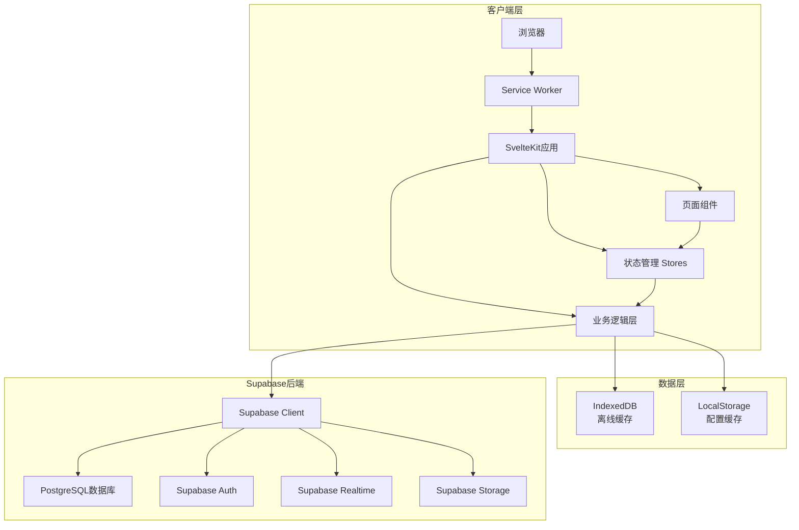
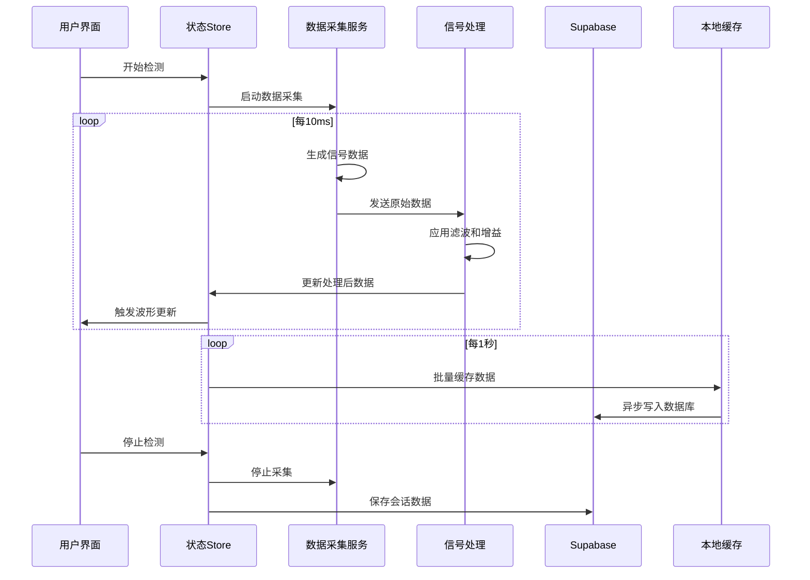

# 设计文档 - 接触式磁检测仪器软件

## 概述

本系统是一个基于Web的工业级磁检测仪器软件，采用现代化的前端技术栈和Supabase作为后端服务。系统设计遵循工业软件的高可靠性、实时性和专业性要求，提供完整的磁信号检测、数据分析和报告生成功能。

### 技术栈选择

经过深入调研，选择以下对AI编程工具最友好、最简单、最标准的技术栈：

**前端框架:** Svelte 5 + SvelteKit
- 理由：语法简洁，编译时优化，性能优异，学习曲线平缓
- 对AI工具友好：代码结构清晰，组件化明确，易于生成和维护

**UI组件库:** Tailwind CSS + DaisyUI
- 理由：实用优先的CSS框架，快速构建工业级UI
- DaisyUI提供现成的组件，减少自定义样式代码

**图表库:** Chart.js + Chartjs-plugin-streaming
- 理由：轻量级，文档完善，支持实时数据流
- 适合绘制磁信号波形和实时监控图表

**状态管理:** Svelte Stores（内置）
- 理由：简单直观，无需额外库，与Svelte深度集成

**后端服务:** Supabase
- 数据库：PostgreSQL（Supabase托管）
- 认证：Supabase Auth
- 实时订阅：Supabase Realtime
- 存储：Supabase Storage（用于报告和附件）

**数据可视化:** D3.js（按需使用）
- 理由：用于复杂的自定义波形绘制和数据可视化

**离线支持:** Workbox（Service Worker）
- 理由：PWA标准，自动缓存管理，离线优先策略

**构建工具:** Vite
- 理由：快速的开发服务器，优化的生产构建，SvelteKit默认集成

**类型检查:** TypeScript
- 理由：类型安全，提高代码质量，AI工具更易理解代码意图

## 架构设计

### 系统架构图



### 分层架构

#### 1. 表现层（Presentation Layer）
- 页面组件：各功能页面的Svelte组件
- UI组件：可复用的按钮、表格、图表等组件
- 布局组件：仪器外壳、导航栏、侧边栏等

#### 2. 业务逻辑层（Business Logic Layer）
- 数据采集服务：模拟磁信号数据生成
- 波形处理服务：信号滤波、增益调整、缺陷检测
- 报告生成服务：PDF生成、数据格式化
- 校准服务：校准算法和系数计算

#### 3. 数据访问层（Data Access Layer）
- Supabase客户端封装
- 离线数据同步管理
- 缓存策略实现

#### 4. 基础设施层（Infrastructure Layer）
- 认证管理
- 错误处理
- 日志记录
- 性能监控

## 组件和接口设计

### 核心组件结构

```
src/
├── lib/
│   ├── components/
│   │   ├── instrument/
│   │   │   ├── InstrumentShell.svelte      # 仪器外壳
│   │   │   ├── LeftPanel.svelte            # 左侧按钮面板
│   │   │   ├── RightPanel.svelte           # 右侧按钮面板
│   │   │   ├── TopBar.svelte               # 顶部状态栏
│   │   │   └── MainDisplay.svelte          # 主显示区域
│   │   ├── waveform/
│   │   │   ├── WaveformChart.svelte        # 波形图表
│   │   │   ├── GateOverlay.svelte          # 闸门覆盖层
│   │   │   └── SignalMarker.svelte         # 信号标记
│   │   ├── data/
│   │   │   ├── DataTable.svelte            # 数据表格
│   │   │   ├── DataGrid.svelte             # 数据网格
│   │   │   └── Pagination.svelte           # 分页控件
│   │   ├── settings/
│   │   │   ├── ParameterPanel.svelte       # 参数设置面板
│   │   │   ├── GateSettings.svelte         # 闸门设置
│   │   │   └── CalibrationWizard.svelte    # 校准向导
│   │   ├── dashboard/
│   │   │   ├── Gauge.svelte                # 仪表盘
│   │   │   ├── ProgressBar.svelte          # 进度条
│   │   │   └── StatusIndicator.svelte      # 状态指示器
│   │   └── common/
│   │       ├── Button.svelte               # 按钮组件
│   │       ├── Modal.svelte                # 模态框
│   │       └── Toast.svelte                # 通知提示
│   ├── services/
│   │   ├── dataAcquisition.ts              # 数据采集服务
│   │   ├── signalProcessing.ts             # 信号处理服务
│   │   ├── reportGenerator.ts              # 报告生成服务
│   │   ├── calibration.ts                  # 校准服务
│   │   └── supabaseClient.ts               # Supabase客户端
│   ├── stores/
│   │   ├── testingStore.ts                 # 检测状态store
│   │   ├── settingsStore.ts                # 设置store
│   │   ├── authStore.ts                    # 认证store
│   │   └── dataStore.ts                    # 数据store
│   ├── utils/
│   │   ├── signalGenerator.ts              # 信号生成器
│   │   ├── defectDetector.ts               # 缺陷检测算法
│   │   ├── dataExporter.ts                 # 数据导出工具
│   │   └── validators.ts                   # 数据验证
│   └── types/
│       ├── testing.ts                      # 检测相关类型
│       ├── signal.ts                       # 信号相关类型
│       └── database.ts                     # 数据库类型
├── routes/
│   ├── +layout.svelte                      # 根布局
│   ├── +page.svelte                        # 主页（仪器界面）
│   ├── login/+page.svelte                  # 登录页
│   ├── dashboard/+page.svelte              # 仪表盘
│   ├── history/+page.svelte                # 历史记录
│   ├── settings/+page.svelte               # 系统设置
│   ├── calibration/+page.svelte            # 校准页面
│   └── reports/+page.svelte                # 报告页面
└── app.html                                # HTML模板
```


### 关键接口定义

#### 1. 数据采集接口

```typescript
interface SignalData {
  timestamp: number;
  amplitude: number;
  phase: number;
  position: number;
  frequency: number;
}

interface TestingSession {
  id: string;
  projectName: string;
  operator: string;
  startTime: Date;
  endTime?: Date;
  status: 'running' | 'paused' | 'completed' | 'error';
  parameters: TestingParameters;
  signalData: SignalData[];
  defects: Defect[];
}

interface TestingParameters {
  gain: number;
  filter: FilterType;
  velocity: number;
  gateA: GateConfig;
  gateB: GateConfig;
  threshold: number;
}
```

#### 2. 闸门配置接口

```typescript
interface GateConfig {
  enabled: boolean;
  start: number;
  width: number;
  height: number;
  alarmThreshold: number;
  color: string;
}
```

#### 3. 缺陷检测接口

```typescript
interface Defect {
  id: string;
  position: number;
  amplitude: number;
  severity: 'low' | 'medium' | 'high' | 'critical';
  timestamp: Date;
  gateTriggered: 'A' | 'B' | 'both';
}
```

#### 4. Supabase服务接口

```typescript
interface SupabaseService {
  // 检测会话管理
  createSession(session: TestingSession): Promise<string>;
  updateSession(id: string, updates: Partial<TestingSession>): Promise<void>;
  getSession(id: string): Promise<TestingSession>;
  listSessions(filters?: SessionFilters): Promise<TestingSession[]>;
  
  // 信号数据管理
  saveSignalData(sessionId: string, data: SignalData[]): Promise<void>;
  getSignalData(sessionId: string): Promise<SignalData[]>;
  
  // 校准数据管理
  saveCalibration(calibration: CalibrationData): Promise<void>;
  getLatestCalibration(): Promise<CalibrationData>;
  
  // 报告管理
  saveReport(report: Report): Promise<string>;
  getReport(id: string): Promise<Report>;
  uploadReportPDF(reportId: string, pdf: Blob): Promise<string>;
}
```

## 数据模型设计

### Supabase数据库表结构

#### 1. users表（使用Supabase Auth）
```sql
-- Supabase Auth自动管理，扩展profile表
CREATE TABLE profiles (
  id UUID REFERENCES auth.users PRIMARY KEY,
  username TEXT UNIQUE NOT NULL,
  full_name TEXT,
  role TEXT CHECK (role IN ('operator', 'engineer', 'admin')),
  created_at TIMESTAMPTZ DEFAULT NOW(),
  updated_at TIMESTAMPTZ DEFAULT NOW()
);
```

#### 2. testing_sessions表
```sql
CREATE TABLE testing_sessions (
  id UUID PRIMARY KEY DEFAULT gen_random_uuid(),
  project_name TEXT NOT NULL,
  operator_id UUID REFERENCES profiles(id),
  start_time TIMESTAMPTZ NOT NULL DEFAULT NOW(),
  end_time TIMESTAMPTZ,
  status TEXT CHECK (status IN ('running', 'paused', 'completed', 'error')),
  parameters JSONB NOT NULL,
  metadata JSONB,
  created_at TIMESTAMPTZ DEFAULT NOW(),
  updated_at TIMESTAMPTZ DEFAULT NOW()
);

CREATE INDEX idx_sessions_operator ON testing_sessions(operator_id);
CREATE INDEX idx_sessions_status ON testing_sessions(status);
CREATE INDEX idx_sessions_start_time ON testing_sessions(start_time DESC);
```

#### 3. signal_data表
```sql
CREATE TABLE signal_data (
  id BIGSERIAL PRIMARY KEY,
  session_id UUID REFERENCES testing_sessions(id) ON DELETE CASCADE,
  timestamp BIGINT NOT NULL,
  amplitude REAL NOT NULL,
  phase REAL,
  position REAL NOT NULL,
  frequency REAL,
  created_at TIMESTAMPTZ DEFAULT NOW()
);

CREATE INDEX idx_signal_session ON signal_data(session_id);
CREATE INDEX idx_signal_timestamp ON signal_data(session_id, timestamp);
```

#### 4. defects表
```sql
CREATE TABLE defects (
  id UUID PRIMARY KEY DEFAULT gen_random_uuid(),
  session_id UUID REFERENCES testing_sessions(id) ON DELETE CASCADE,
  position REAL NOT NULL,
  amplitude REAL NOT NULL,
  severity TEXT CHECK (severity IN ('low', 'medium', 'high', 'critical')),
  gate_triggered TEXT CHECK (gate_triggered IN ('A', 'B', 'both')),
  timestamp TIMESTAMPTZ NOT NULL,
  notes TEXT,
  created_at TIMESTAMPTZ DEFAULT NOW()
);

CREATE INDEX idx_defects_session ON defects(session_id);
CREATE INDEX idx_defects_severity ON defects(severity);
```

#### 5. calibrations表
```sql
CREATE TABLE calibrations (
  id UUID PRIMARY KEY DEFAULT gen_random_uuid(),
  operator_id UUID REFERENCES profiles(id),
  calibration_type TEXT NOT NULL,
  reference_signal JSONB NOT NULL,
  coefficients JSONB NOT NULL,
  standard_block TEXT,
  calibration_date TIMESTAMPTZ NOT NULL DEFAULT NOW(),
  expiry_date TIMESTAMPTZ,
  is_active BOOLEAN DEFAULT true,
  created_at TIMESTAMPTZ DEFAULT NOW()
);

CREATE INDEX idx_calibrations_active ON calibrations(is_active, calibration_date DESC);
```

#### 6. reports表
```sql
CREATE TABLE reports (
  id UUID PRIMARY KEY DEFAULT gen_random_uuid(),
  session_id UUID REFERENCES testing_sessions(id),
  report_type TEXT NOT NULL,
  standard TEXT, -- ASME, ISO, EN等
  content JSONB NOT NULL,
  pdf_url TEXT,
  generated_by UUID REFERENCES profiles(id),
  generated_at TIMESTAMPTZ DEFAULT NOW(),
  created_at TIMESTAMPTZ DEFAULT NOW()
);

CREATE INDEX idx_reports_session ON reports(session_id);
```


### Row Level Security (RLS) 策略

```sql
-- 启用RLS
ALTER TABLE testing_sessions ENABLE ROW LEVEL SECURITY;
ALTER TABLE signal_data ENABLE ROW LEVEL SECURITY;
ALTER TABLE defects ENABLE ROW LEVEL SECURITY;
ALTER TABLE calibrations ENABLE ROW LEVEL SECURITY;
ALTER TABLE reports ENABLE ROW LEVEL SECURITY;

-- 操作员只能查看自己的会话
CREATE POLICY "Users can view own sessions"
  ON testing_sessions FOR SELECT
  USING (auth.uid() = operator_id);

-- 管理员可以查看所有会话
CREATE POLICY "Admins can view all sessions"
  ON testing_sessions FOR SELECT
  USING (
    EXISTS (
      SELECT 1 FROM profiles
      WHERE id = auth.uid() AND role = 'admin'
    )
  );

-- 用户可以创建会话
CREATE POLICY "Users can create sessions"
  ON testing_sessions FOR INSERT
  WITH CHECK (auth.uid() = operator_id);

-- 类似的策略应用到其他表...
```

## 错误处理策略

### 错误分类

#### 1. 网络错误
- 离线状态：切换到离线模式，使用本地缓存
- 超时：重试机制（指数退避）
- 连接失败：显示友好提示，提供手动重试

#### 2. 数据验证错误
- 参数超出范围：阻止保存，显示具体错误信息
- 必填字段缺失：高亮显示缺失字段
- 格式错误：实时验证并提示正确格式

#### 3. 业务逻辑错误
- 校准过期：提示重新校准
- 权限不足：显示权限说明，引导联系管理员
- 数据冲突：提供冲突解决选项

#### 4. 系统错误
- 未捕获异常：全局错误边界捕获，记录日志
- 内存溢出：限制数据缓存大小，自动清理
- 浏览器兼容性：检测并提示升级浏览器

### 错误处理流程

```typescript
class ErrorHandler {
  static handle(error: Error, context: ErrorContext): void {
    // 1. 记录错误日志
    this.logError(error, context);
    
    // 2. 分类错误
    const errorType = this.classifyError(error);
    
    // 3. 根据类型处理
    switch (errorType) {
      case 'network':
        this.handleNetworkError(error);
        break;
      case 'validation':
        this.handleValidationError(error);
        break;
      case 'business':
        this.handleBusinessError(error);
        break;
      default:
        this.handleSystemError(error);
    }
    
    // 4. 显示用户友好的错误消息
    this.showUserMessage(error, errorType);
  }
}
```

## 测试策略

### 测试金字塔

#### 1. 单元测试（70%）
- 工具函数测试：信号处理、数据验证、格式化等
- Store测试：状态管理逻辑
- 服务层测试：业务逻辑、API调用

**工具:** Vitest

#### 2. 集成测试（20%）
- 组件集成测试：组件间交互
- API集成测试：与Supabase的交互
- 数据流测试：端到端数据流

**工具:** Vitest + Testing Library

#### 3. E2E测试（10%）
- 关键用户流程：登录、检测、报告生成
- 跨浏览器测试：Chrome、Firefox、Safari
- 性能测试：波形渲染性能、大数据量处理

**工具:** Playwright

### 测试覆盖率目标
- 代码覆盖率：≥80%
- 分支覆盖率：≥75%
- 关键路径覆盖率：100%

## 性能优化设计

### 1. 波形渲染优化
- 使用Canvas而非SVG绘制波形（更高性能）
- 实现虚拟滚动，只渲染可见区域
- 使用Web Worker处理信号数据，避免阻塞主线程
- 采用requestAnimationFrame优化动画帧率

### 2. 数据处理优化
- 批量写入数据库（每秒最多1次）
- 使用IndexedDB缓存大量历史数据
- 实现数据分页加载，避免一次加载全部数据
- 压缩存储的JSON数据

### 3. 网络优化
- 启用Supabase连接池
- 使用Supabase Realtime订阅减少轮询
- 实现请求去重和合并
- 图片和资源使用CDN

### 4. 代码优化
- 代码分割：按路由懒加载
- Tree Shaking：移除未使用的代码
- 压缩和混淆：生产环境优化
- 使用Svelte的编译时优化

## 安全设计

### 1. 认证和授权
- 使用Supabase Auth的JWT令牌
- 实现基于角色的访问控制（RBAC）
- 会话超时自动登出
- 密码强度要求和多因素认证（可选）

### 2. 数据安全
- 所有API调用使用HTTPS
- 敏感数据加密存储
- 实施Row Level Security（RLS）
- 定期备份数据库

### 3. 前端安全
- 防止XSS攻击：使用Svelte的自动转义
- 防止CSRF攻击：使用Supabase的内置保护
- 内容安全策略（CSP）
- 输入验证和清理

### 4. 审计日志
- 记录所有关键操作（登录、数据修改、报告生成）
- 记录失败的认证尝试
- 定期审查日志

## 国际标准符合性设计

### 支持的标准
1. **ASME Section V** - 无损检测标准
2. **ISO 9712** - 无损检测人员资格认证
3. **EN 10228** - 钢锻件无损检测
4. **ASTM E709** - 磁粉检测标准

### 标准实现方式

#### 1. 预设参数模板
```typescript
const standardPresets = {
  'ASME-V-Article-7': {
    gain: 60,
    filter: 'bandpass',
    frequency: 100,
    gateA: { start: 0, width: 100, threshold: 0.5 },
    // ... 其他参数
  },
  'ISO-9712-Level-2': {
    // ... 参数配置
  }
};
```

#### 2. 报告模板
- 每个标准对应一个报告模板
- 包含标准要求的所有字段
- 自动填充检测数据
- 生成符合标准格式的PDF

#### 3. 校准程序
- 按标准要求的校准步骤
- 使用标准试块
- 记录校准证书信息
- 校准有效期管理

## 用户界面设计细节

### 工业风格设计规范

#### 颜色方案
```css
:root {
  /* 主色调 - 橙色 */
  --primary-orange: #FF6B35;
  --primary-orange-dark: #E55A2B;
  --primary-orange-light: #FF8555;
  
  /* 背景色 - 深灰/黑 */
  --bg-dark: #1A1A1A;
  --bg-medium: #2D2D2D;
  --bg-light: #3D3D3D;
  
  /* 文字颜色 */
  --text-primary: #FFFFFF;
  --text-secondary: #B0B0B0;
  --text-disabled: #666666;
  
  /* 状态颜色 */
  --success: #4CAF50;
  --warning: #FFC107;
  --error: #F44336;
  --info: #2196F3;
  
  /* 波形颜色 */
  --waveform-signal: #00FF00;
  --waveform-grid: #333333;
  --waveform-gate-a: #FFD700;
  --waveform-gate-b: #FF69B4;
}
```

#### 字体
- 主字体：Roboto（清晰易读）
- 数字字体：Roboto Mono（等宽，适合数据显示）
- 中文字体：思源黑体

#### 按钮设计
- 大尺寸按钮（适合触摸屏）
- 明确的按下状态反馈
- 图标+文字组合
- 橙色高亮活动状态

### 响应式布局断点
```css
/* 桌面 */
@media (min-width: 1024px) { /* 完整仪器界面 */ }

/* 平板 */
@media (min-width: 768px) and (max-width: 1023px) { /* 简化布局 */ }

/* 移动 */
@media (max-width: 767px) { /* 垂直堆叠布局 */ }
```


## 实时数据流设计

### 数据采集流程



### 信号生成算法

为了模拟真实的磁检测信号，实现以下算法：

```typescript
class SignalGenerator {
  // 基础信号：正弦波 + 噪声
  generateBaseSignal(time: number): number {
    const frequency = 100; // Hz
    const amplitude = 1.0;
    const noise = (Math.random() - 0.5) * 0.1;
    return amplitude * Math.sin(2 * Math.PI * frequency * time) + noise;
  }
  
  // 缺陷信号：高斯脉冲
  generateDefectSignal(time: number, defectPosition: number): number {
    const sigma = 0.01; // 脉冲宽度
    const amplitude = 2.0; // 缺陷幅值
    const distance = time - defectPosition;
    return amplitude * Math.exp(-(distance * distance) / (2 * sigma * sigma));
  }
  
  // 组合信号
  generateSignal(time: number, defects: DefectConfig[]): SignalData {
    let signal = this.generateBaseSignal(time);
    
    // 叠加缺陷信号
    for (const defect of defects) {
      signal += this.generateDefectSignal(time, defect.position);
    }
    
    return {
      timestamp: Date.now(),
      amplitude: signal,
      phase: this.calculatePhase(signal),
      position: time,
      frequency: 100
    };
  }
}
```

## 离线模式实现

### Service Worker策略

```typescript
// service-worker.ts
import { precacheAndRoute } from 'workbox-precaching';
import { registerRoute } from 'workbox-routing';
import { CacheFirst, NetworkFirst, StaleWhileRevalidate } from 'workbox-strategies';

// 预缓存静态资源
precacheAndRoute(self.__WB_MANIFEST);

// API请求：网络优先
registerRoute(
  ({ url }) => url.pathname.startsWith('/api/'),
  new NetworkFirst({
    cacheName: 'api-cache',
    networkTimeoutSeconds: 10
  })
);

// 图片：缓存优先
registerRoute(
  ({ request }) => request.destination === 'image',
  new CacheFirst({
    cacheName: 'image-cache',
    plugins: [
      {
        cacheWillUpdate: async ({ response }) => {
          return response.status === 200 ? response : null;
        }
      }
    ]
  })
);

// Supabase请求：后台同步
self.addEventListener('sync', (event) => {
  if (event.tag === 'sync-data') {
    event.waitUntil(syncOfflineData());
  }
});
```

### IndexedDB数据结构

```typescript
// 使用Dexie.js简化IndexedDB操作
import Dexie from 'dexie';

class AppDatabase extends Dexie {
  sessions!: Dexie.Table<TestingSession, string>;
  signalData!: Dexie.Table<SignalData, number>;
  pendingSync!: Dexie.Table<PendingSyncItem, number>;
  
  constructor() {
    super('MagneticTestingDB');
    
    this.version(1).stores({
      sessions: 'id, startTime, status',
      signalData: '++id, sessionId, timestamp',
      pendingSync: '++id, type, timestamp'
    });
  }
}

const db = new AppDatabase();
```

## 报告生成设计

### PDF生成流程

使用jsPDF和html2canvas生成PDF报告：

```typescript
import jsPDF from 'jspdf';
import html2canvas from 'html2canvas';

class ReportGenerator {
  async generatePDF(session: TestingSession, template: string): Promise<Blob> {
    const doc = new jsPDF('p', 'mm', 'a4');
    
    // 1. 添加报告头
    this.addHeader(doc, session);
    
    // 2. 添加检测参数表
    this.addParametersTable(doc, session.parameters);
    
    // 3. 添加波形图（截图）
    const waveformCanvas = await this.captureWaveform();
    const waveformImage = waveformCanvas.toDataURL('image/png');
    doc.addImage(waveformImage, 'PNG', 10, 60, 190, 80);
    
    // 4. 添加数据表格
    this.addDataTable(doc, session.signalData);
    
    // 5. 添加缺陷统计
    this.addDefectSummary(doc, session.defects);
    
    // 6. 添加结论和签名
    this.addConclusion(doc, session);
    
    return doc.output('blob');
  }
  
  private async captureWaveform(): Promise<HTMLCanvasElement> {
    const waveformElement = document.getElementById('waveform-chart');
    return await html2canvas(waveformElement!);
  }
}
```

### 报告模板

#### ASME标准报告模板
```typescript
const asmeReportTemplate = {
  header: {
    title: 'Magnetic Particle Testing Report',
    standard: 'ASME Section V, Article 7',
    logo: '/assets/company-logo.png'
  },
  sections: [
    {
      title: 'Test Information',
      fields: ['projectName', 'testDate', 'operator', 'equipment']
    },
    {
      title: 'Test Parameters',
      fields: ['magnetizationType', 'current', 'particleType', 'lighting']
    },
    {
      title: 'Test Results',
      content: 'waveform-and-data'
    },
    {
      title: 'Defect Indications',
      content: 'defect-table'
    },
    {
      title: 'Conclusion',
      fields: ['acceptanceCriteria', 'result', 'remarks']
    },
    {
      title: 'Signatures',
      fields: ['operator', 'inspector', 'date']
    }
  ]
};
```

## 部署架构

### 托管方案

#### 前端托管：Vercel
- 自动从Git部署
- 全球CDN加速
- 自动HTTPS
- 预览环境

#### 后端服务：Supabase
- 托管PostgreSQL数据库
- 自动备份
- 实时订阅
- 文件存储

### 环境配置

#### 开发环境
```env
PUBLIC_SUPABASE_URL=https://zzyueuweeoakopuuwfau.supabase.co
PUBLIC_SUPABASE_ANON_KEY=eyJhbGciOiJIUzI1NiIsInR5cCI6IkpXVCJ9...
VITE_ENV=development
```

#### 生产环境
```env
PUBLIC_SUPABASE_URL=https://zzyueuweeoakopuuwfau.supabase.co
PUBLIC_SUPABASE_ANON_KEY=eyJhbGciOiJIUzI1NiIsInR5cCI6IkpXVCJ9...
VITE_ENV=production
```

### CI/CD流程

```yaml
# .github/workflows/deploy.yml
name: Deploy

on:
  push:
    branches: [main]

jobs:
  deploy:
    runs-on: ubuntu-latest
    steps:
      - uses: actions/checkout@v3
      - uses: actions/setup-node@v3
        with:
          node-version: '18'
      - run: npm ci
      - run: npm run build
      - run: npm run test
      - uses: amondnet/vercel-action@v20
        with:
          vercel-token: ${{ secrets.VERCEL_TOKEN }}
          vercel-org-id: ${{ secrets.ORG_ID }}
          vercel-project-id: ${{ secrets.PROJECT_ID }}
```

## 可访问性设计

### WCAG 2.1 AA级别符合性

#### 1. 键盘导航
- 所有功能可通过键盘访问
- 明确的焦点指示器
- 逻辑的Tab顺序

#### 2. 屏幕阅读器支持
- 语义化HTML标签
- ARIA标签和角色
- 图表的文字描述

#### 3. 颜色对比度
- 文字与背景对比度≥4.5:1
- 大文字对比度≥3:1
- 不仅依赖颜色传达信息

#### 4. 响应式文字大小
- 支持浏览器文字缩放
- 使用相对单位（rem, em）

## 国际化设计

### 多语言支持

使用svelte-i18n实现国际化：

```typescript
// src/lib/i18n/index.ts
import { init, register, locale } from 'svelte-i18n';

register('zh-CN', () => import('./locales/zh-CN.json'));
register('en-US', () => import('./locales/en-US.json'));

init({
  fallbackLocale: 'zh-CN',
  initialLocale: 'zh-CN'
});
```

### 翻译文件结构

```json
// locales/zh-CN.json
{
  "app": {
    "title": "磁检测仪器",
    "brand": "DOPPLER"
  },
  "buttons": {
    "start": "开始",
    "stop": "停止",
    "save": "保存",
    "menu": "菜单"
  },
  "parameters": {
    "gain": "增益",
    "filter": "滤波器",
    "velocity": "速度",
    "threshold": "阈值"
  }
}
```

## 监控和日志

### 性能监控

```typescript
// 使用Web Vitals监控性能
import { getCLS, getFID, getFCP, getLCP, getTTFB } from 'web-vitals';

function sendToAnalytics(metric: Metric) {
  // 发送到分析服务
  console.log(metric);
}

getCLS(sendToAnalytics);
getFID(sendToAnalytics);
getFCP(sendToAnalytics);
getLCP(sendToAnalytics);
getTTFB(sendToAnalytics);
```

### 错误日志

```typescript
// 全局错误处理
window.addEventListener('error', (event) => {
  logError({
    type: 'uncaught-error',
    message: event.message,
    stack: event.error?.stack,
    timestamp: new Date().toISOString()
  });
});

window.addEventListener('unhandledrejection', (event) => {
  logError({
    type: 'unhandled-rejection',
    reason: event.reason,
    timestamp: new Date().toISOString()
  });
});
```

## 总结

本设计文档详细描述了磁检测仪器软件的技术架构、数据模型、接口设计、安全策略和实现细节。采用Svelte + SvelteKit + Supabase的技术栈，确保了开发效率和代码质量。系统设计充分考虑了工业应用的特殊需求，包括实时性、可靠性、符合国际标准等方面。
